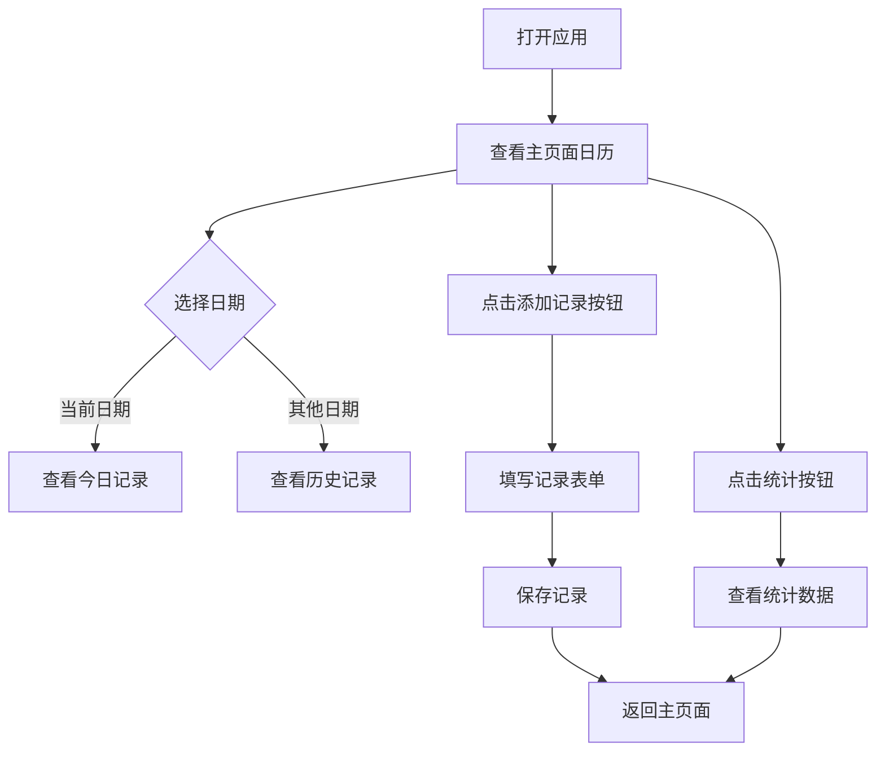

## 1. Product Overview
如厕日记网站是一款帮助用户记录和追踪日常排便情况的健康管理应用。用户可以记录如厕时间、粪便性状和相关描述，并通过日历视图查看历史记录和统计数据。
- 主要功能：如厕记录、日历查看、数据统计
- 目标用户：关注肠道健康的人群
- 市场价值：提供便捷的肠道健康追踪工具，帮助用户了解和改善肠道健康

## 2. Core Features

### 2.1 User Roles
本产品为单用户应用，无需角色区分。

### 2.2 Feature Module
1. **主页面**：日历视图、今日记录展示、记录添加
2. **统计页面**：数据统计展示、频率分析

### 2.3 Page Details
| Page Name | Module Name | Feature description |
|-----------|-------------|---------------------|
| 主页面 | 日历组件 | 展示完整月份日历，支持日期选择，显示当前日期高亮，有记录的日期显示图标标记 |
| 主页面 | 记录列表 | 显示选中日期的所有如厕记录 |
| 主页面 | 添加记录 | 悬浮按钮，点击打开记录表单 |
| 主页面 | 记录表单 | 日期时间选择、性状标签选择、描述输入 |
| 统计页面 | 统计卡片 | 展示本月如厕次数、平均频率等数据 |
| 统计页面 | 悬浮按钮 | 返回主页面 |

## 3. Core Process
用户打开应用后看到主页面，默认显示当前日期的记录。用户可以在日历上选择其他日期查看历史记录。点击添加记录按钮，表单自动填入选中日期，用户选择性状并添加描述后保存记录。点击右下角的悬浮按钮进入统计页面查看健康数据。

## 4. User Interface Design
### 4.1 Design Style
- 主色调：柔和的绿色系（代表健康、自然）
- 辅助色：浅灰色、白色
- 按钮风格：圆角、扁平化，轻微阴影
- 字体：使用 Inter 字体，清晰易读
- 布局风格：移动端优先，卡片式设计，简洁清爽
- 图标：使用 Lucide 图标库，线条简洁

### 4.2 Page Design Overview
| Page Name | Module Name | UI Elements |
|-----------|-------------|-------------|
| 主页面 | 日历组件 | 月视图布局，日期格子，今日日期高亮，有记录的日期显示图标 |
| 主页面 | 记录列表 | 卡片式记录，显示时间、性状标签、描述 |
| 主页面 | 添加记录 | 右下角浮动按钮，绿色圆形 + 号 |
| 主页面 | 记录表单 | 模态框，表单元素垂直排列 |
| 统计页面 | 统计卡片 | 网格布局，卡片展示统计数据 |
| 统计页面 | 悬浮按钮 | 右下角返回按钮 |

### 4.3 Responsiveness
- 移动端优先设计
- 响应式适配平板和桌面端不同尺寸
- 触摸优化，大点击区域

### 4.4 3D Scene Guidance
本项目不包含 3D 场景。
