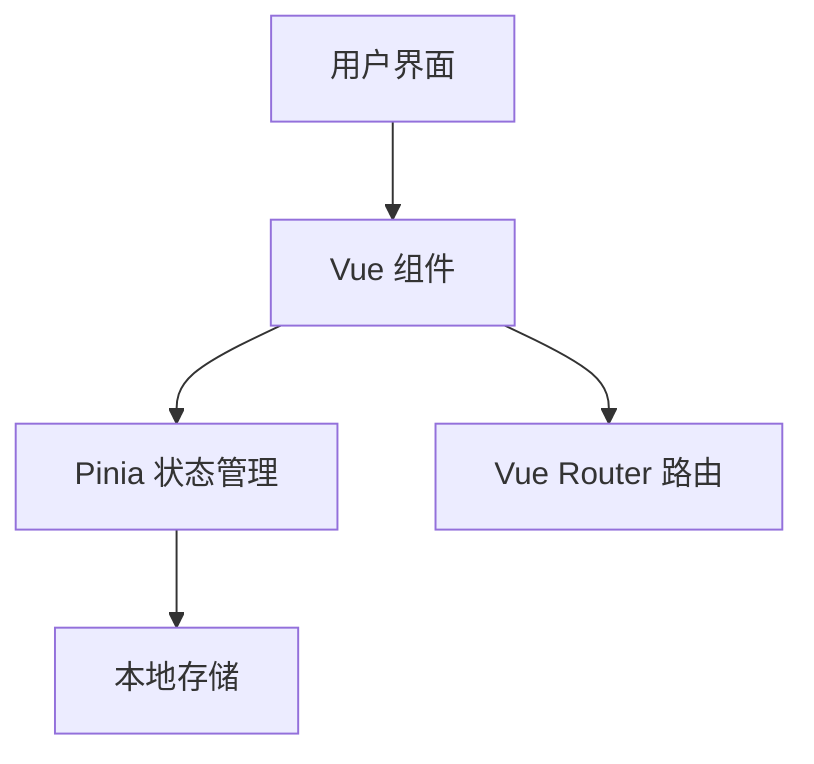
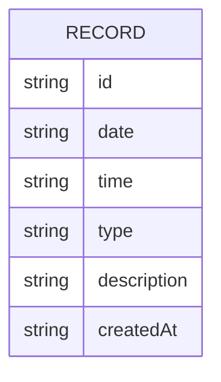

## 1. Architecture Design
本项目为纯前端应用，使用 Vue 3 + Vite 构建，数据通过 Pinia 状态管理 + Pinia Plugin Persistedstate 本地持久化存储。



## 2. Technology Description
- Frontend: Vue@3.5.x + TypeScript + Vite@8.x + Tailwind CSS
- 路由管理: Vue Router@5.x + unplugin-vue-router（自动生成路由）
- 状态管理: Pinia@3.x + Pinia Plugin Persistedstate@4.5.x
- UI 组件库: shadcn-vue
- 图标库: lucide-vue-next

## 3. Route Definitions
| Route | Purpose |
|-------|---------|
| / | 主页面 - 日历和记录展示 |
| /stats | 统计页面 - 数据统计展示 |

## 4. Data Model
### 4.1 Data Model Definition



### 4.2 TypeScript Interfaces

```typescript
// 粪便性状类型
type StoolType = 
  | 'type1'  // 坚果状
  | 'type2'  // 腊肠状
  | 'type3'  // 香肠状，表面有裂纹
  | 'type4'  // 香肠或蛇状，光滑柔软
  | 'type5'  // 软团状，边缘清晰
  | 'type6'  // 糊状
  | 'type7'; // 水样

// 如厕记录
interface ToiletRecord {
  id: string;
  date: string; // YYYY-MM-DD 格式
  time: string; // HH:mm 格式
  type: StoolType;
  description: string;
  createdAt: string; // ISO 时间戳
}

// 性状选项配置
interface StoolTypeOption {
  value: StoolType;
  label: string;
  description: string;
}
```
